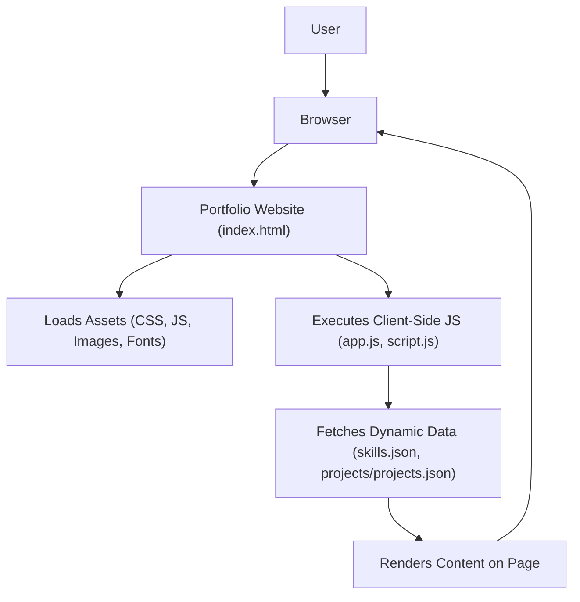

# 🚀 Portfolio Website

<p align="center"></p>

## Short Description
This repository hosts a cutting-edge, responsive personal portfolio website designed to brilliantly showcase a developer's skills, professional experience, and diverse projects. Engineered for clarity and impact, it leverages modern web technologies to present a dynamic and engaging online presence.

## ✨ Key Features
*   **Dynamic Content Management:** Easily update projects and skills via simple JSON files, keeping your portfolio fresh without deep code changes.
*   **Comprehensive Professional Showcase:** Dedicated sections for detailing your work experience and educational background.
*   **Automated Deployment (CI/CD):** Integrated GitHub Actions workflow ensures seamless, automated updates and deployments.
*   **Responsive & Adaptive Design:** Crafted with modern CSS to provide an impeccable viewing experience across all devices, from desktops to mobile.
*   **Interactive User Interface:** Engages visitors with dynamic visual elements, powered by libraries like `particles.min.js`.
*   **Downloadable Resume:** Provides direct access to your professional resume for quick reference by recruiters.
*   **Elegant Error Handling:** Custom 404 page for a polished user experience even on broken links.

## Who is this for?
*   **Aspiring & Experienced Developers:** Create a powerful first impression with a professional and interactive online resume.
*   **Freelancers & Consultants:** Effectively highlight your expertise and project successes to attract new clients.
*   **Job Seekers:** Provide recruiters and hiring managers with a comprehensive overview of your technical prowess and experience.
*   **Students:** Build a compelling digital presence to showcase academic projects and growing skill sets.

## Technology Stack & Architecture
*   **Frontend Development:** HTML5, CSS3 (with custom styling), Vanilla JavaScript.
*   **Interactive Libraries:** `particles.min.js` for engaging visual effects.
*   **Build & Automation:** GitHub Actions for Continuous Integration/Continuous Deployment (CI/CD).
*   **Data Management:** Lightweight, local JSON files (`skills.json`, `projects/projects.json`) for dynamic content population.
*   **Version Control:** Git.
*   **Development Environment:** Configured for Visual Studio Code (`.vscode/settings.json`).

## 📊 Architecture & Database Schema
This portfolio website operates as a client-side rendered application, dynamically loading content from local JSON files rather than a traditional backend database. The architecture is optimized for performance, scalability, and ease of deployment as a static site.



## ⚡ Quick Start Guide
Get your local copy of this portfolio website up and running in minutes!

1.  **Clone the repository:**
    ```bash
    git clone https://github.com/GC-the-coder/portfolio_website.git
    cd portfolio_website
    ```

2.  **Open in your browser:**
    Navigate to the `portfolio_website` directory and simply open the `index.html` file in your preferred web browser.

    ```bash
    # Example for Linux/macOS
    open index.html

    # Example for Windows
    start index.html
    ```
    For a fully functional experience, especially when developing locally, it's recommended to serve the files using a simple HTTP server (e.g., `python -m http.server` or Live Server VS Code extension).

## 📜 License
This project is licensed under the MIT License. See the [LICENSE](LICENSE) file for details.